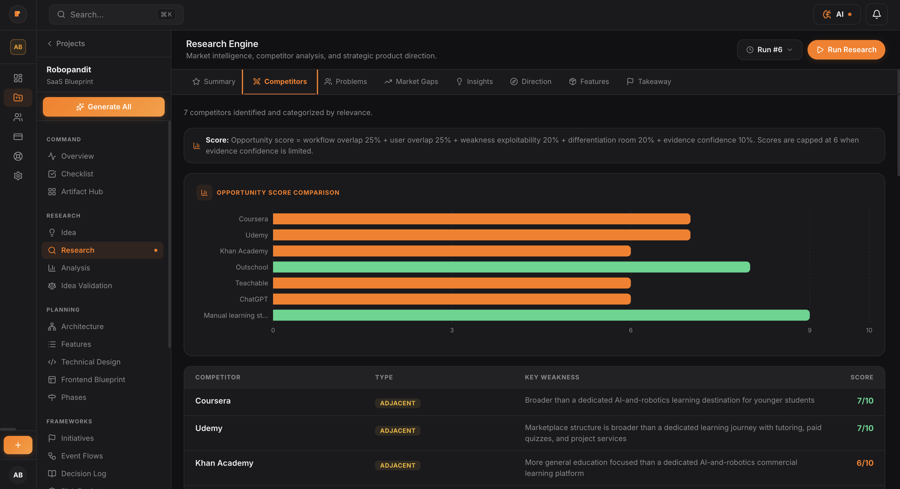
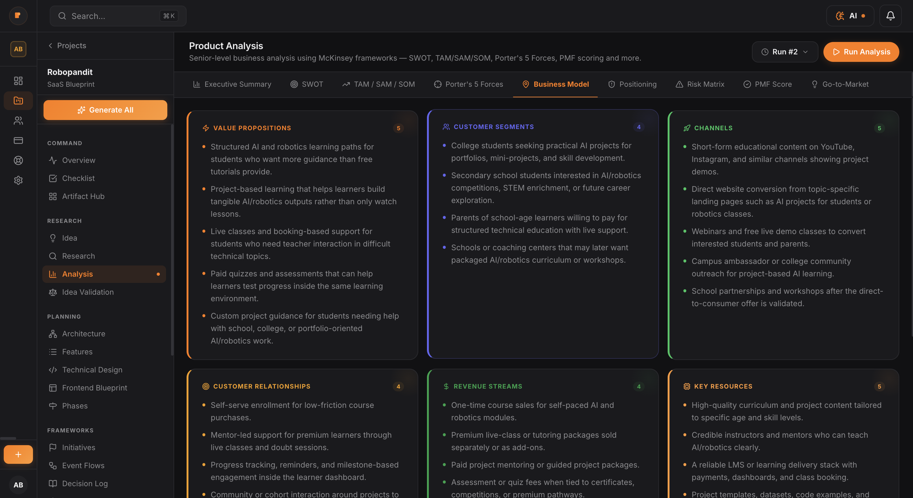
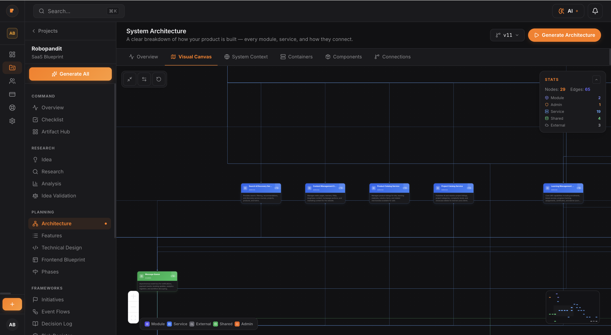
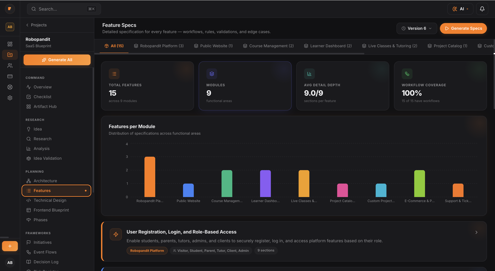
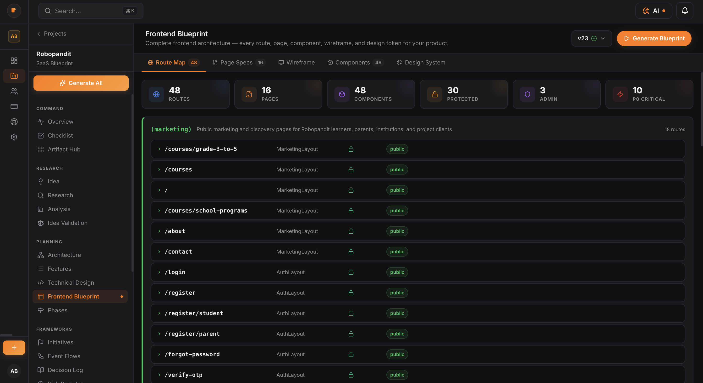
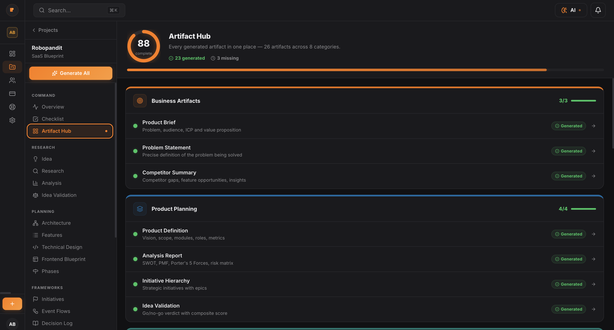

<div align="center">


# PlanMySaaS — Claude Skill

**Turn a one-line SaaS idea into a complete blueprint, right inside Claude Code.**

[](LICENSE)
[](https://docs.anthropic.com/claude/docs/skills)
[](https://planmysaas.com)
[](https://github.com/creationskiro/planmysaas-claude-skill/stargazers)

[**Install**](#-install) · [**Use**](#-use) · [**See it in action**](#-see-what-you-get-back) · [**Customise**](#-customise) · [**Roadmap**](#-roadmap)

</div>

---

## ⚡ The 30-second version

Type one line in Claude Code. Get back nine markdown files in your project folder. Real research, real architecture, real Cursor-ready prompts. Two minutes. No browser. No signup. No API key.

```bash
$ /planmysaas "AI tutor for JEE students, voice-first, ₹99/month"

✓ Blueprint generated for: AI tutor for JEE students…

  ./planmysaas-blueprint/
  ├── 01-idea.md            ← Refined idea + audience + business model
  ├── 02-research.md        ← Competitors, problem clusters, opportunities
  ├── 03-analysis.md        ← BMC, SWOT, PMF score, risk matrix
  ├── 04-architecture.md    ← Services, data models, API surface
  ├── 05-features.md        ← Feature specs with user flows
  ├── 06-frontend.md        ← Routes, wireframes, component tree
  ├── 07-phases.md          ← Release plan + milestones
  ├── 08-build-prompts.md   ← Ready-to-paste prompts for Cursor / Claude Code
  └── README.md             ← Index of everything
```

---

## 📦 Install

One command. The skill auto-discovers from your `~/.claude/skills/` folder on startup.

```bash
git clone https://github.com/creationskiro/planmysaas-claude-skill ~/.claude/skills/planmysaas
```

That's it. Restart Claude Code (or open a new session) and the skill is live.

---

## 🚀 Use

In Claude Code, run the slash command:

```
/planmysaas "your one-line saas idea"
```

Or just describe a product idea naturally — Claude picks up the skill from the description:

> *"Help me plan a SaaS for AI + robotics learning for school students"*
>
> *"Turn this idea into a structured blueprint: AI tutor for JEE students, voice-first, ₹99 per month"*
>
> *"I want to build a course platform for college students. Give me an architecture and feature list."*

The skill writes a fresh `./planmysaas-blueprint/` folder in your current project directory. Open `README.md` first — it indexes the rest.

---

## 📁 See what you get back

Each file in `./planmysaas-blueprint/` is a deep, structured document written for **engineers and founders, not for marketers**. Below are screenshots from the [PlanMySaaS dashboard](https://planmysaas.com) showing what each section looks like when rendered visually. The skill outputs the same data as markdown.

### `02-research.md` — Real competitor analysis with opportunity scoring



5–8 real competitors, classified into direct / adjacent / substitute / manual-alternative. Each gets an opportunity score from 1–10 based on workflow overlap, weakness exploitability, and differentiation room. Plus problem clusters, market gaps, insights, and a strategic direction with the recommended wedge.

---

### `03-analysis.md` — Business model canvas, SWOT, PMF score, risk matrix



The full 9-block business model canvas, plus directional TAM/SAM/SOM, Porter's 5 forces, SWOT, competitive positioning, a 7-row risk matrix, a 6-dimension PMF score breakdown, and a phased strategic recommendation list.

---

### `04-architecture.md` — System design with services, data models, APIs



3–5 top-level containers, 10–25 services or modules grouped by domain, 8–15 core data models with relations, 20+ REST API endpoints, background jobs, external integrations, and an opinionated tech stack with one row per layer.

---

### `05-features.md` — Feature specs with user flows + acceptance criteria



12–20 feature specs, each with a numeric ID (F-01, F-02 …), priority (P0–P3), effort estimate in days, primary actors, purpose, numbered user flow, testable acceptance criteria, edge cases, and telemetry events to fire.

---

### `06-frontend.md` — Routes, wireframes, component tree, design system



Routes grouped by public/app/admin sections, page specs for the top 8 routes, ASCII wireframes you can read in the markdown file, a component tree of 12–25 reusable components with their key props, and a design system covering colors, typography, spacing, radius, shadow, and motion.

---

### Final → Everything in one Artifact Hub view



In the [dashboard](https://planmysaas.com), all sections land in an Artifact Hub view (above) with completion tracking, version history, and exports. The skill ships the same content as portable markdown — no lock-in.

---

## 🎯 Skill vs Dashboard

The skill and the [PlanMySaaS dashboard](https://planmysaas.com) are not competitors. They are the same product expressed at two different friction levels.

| Capability | This Skill | [planmysaas.com](https://planmysaas.com) |
|---|:---:|:---:|
| Top-level stages generated | 8 | **30+** |
| Total generated pages / artifacts | 9 markdown files | **26+ artifacts across 8 categories** |
| Sub-views per stage | inline sections | **multi-tab pages** (Research = 8 tabs, Analysis = 9, Architecture = 6, Phases = 9 …) |
| Sidebar workflow groups | — | **7 groups** — Command · Research · Planning · Frameworks · Output · Evolution · Tools |
| Inline charts (recharts) | — | ✓ bars, canvas, score dials |
| Visual architecture canvas | text only | ✓ drag-able 29-node diagram |
| Auto-research on real competitors (web search) | Claude only | ✓ deep research, 60 sub-topics |
| Version history per stage | — | ✓ diff view + rollback |
| Re-run any stage with feedback | — | ✓ |
| Team collaboration | — | ✓ workspaces + invites |
| Build tracker (post-blueprint) | — | ✓ kanban-style progress |
| Risk register · decision log · event flows | — | ✓ dedicated pages |
| Exports (PDF, JSON, ZIP, public share link) | — | ✓ |
| Admin-side runbooks (refunds, password resets, etc.) | — | ✓ for ops teams |
| Cost per use | your Claude tokens | credits (100 free) |
| Internet required | — | ✓ |
| Account required | — | ✓ |
| Best for | Solo · in-editor · fast loop | Teams · long projects · iteration over months |

**Use the skill** when you are exploring an idea, prototyping for a hackathon, or already deep in Cursor / Claude Code.

**Use the dashboard** when the project is real — when you have decided to spend three months on it, when a co-founder joins, when you want exports for a pitch deck, or when you need version history because you will iterate on the wedge based on early customer interviews.

---

## 🛠️ Customise

The skill is plain markdown. Open any file in `~/.claude/skills/planmysaas/` and edit it.

```
~/.claude/skills/planmysaas/
├── SKILL.md                  ← Frontmatter + orchestration workflow
├── README.md                 ← This file
├── LICENSE                   ← MIT
├── pipeline/
│   ├── 01-idea-refine.md     ← Stage 1 prompt
│   ├── 02-research.md        ← Stage 2 prompt
│   ├── 03-analysis.md        ← Stage 3 prompt
│   ├── 04-architecture.md    ← Stage 4 prompt
│   ├── 05-features.md        ← Stage 5 prompt
│   ├── 06-frontend.md        ← Stage 6 prompt
│   ├── 07-phases.md          ← Stage 7 prompt
│   └── 08-build-prompts.md   ← Stage 8 prompt
├── templates/
│   ├── blueprint-readme.md   ← Final README template
│   └── cursor-prompt-pack.md ← Quick-reference cheat sheet
└── assets/                   ← README screenshots
```

Common tweaks:

- **Change default tech stack** — edit `pipeline/04-architecture.md`. Replace Next.js / Postgres / Vercel with your preferred defaults.
- **Add a stage** — drop a new file like `pipeline/09-marketing.md`, then add it to the pipeline table in `SKILL.md`.
- **Tighten the tone** — every prompt has a *Tone* section at the bottom. Rewrite it.
- **Change the output folder** — search `./planmysaas-blueprint/` in `SKILL.md` and replace.
- **Localise** — add Hindi / Spanish / French versions of any prompt; Claude will follow the language you ask in.

No build step. No package.json. No deploy. Save the file, run `/planmysaas` again, the next invocation uses the new prompt.

---

## 🗺️ Roadmap

| When | What |
|---|---|
| **Now (v1.0)** | 8-stage prompt-based pipeline · MIT · auto-discovery · markdown output |
| **Next 2 weeks** | Optional `auth.md` for API mode — connect a PlanMySaaS API key to save the project to your dashboard with charts, version history, and exports |
| **Q3 2026** | Skill variants — `/planmysaas-mvp` (faster 4-stage cut), `/planmysaas-validate` (idea validation only), `/planmysaas-redesign` (replan an existing product) |
| **Q3 2026** | MCP server — same engine over Model Context Protocol so it works in any MCP-compatible client (Cursor, Cline, Continue) |
| **Q4 2026** | Localisation — Hindi / Hinglish prompts for Indian founders |

Want something else? [Open an issue](https://github.com/creationskiro/planmysaas-claude-skill/issues/new) — small skill, fast PRs.

---

## 🤝 Contributing

Forks, PRs, and issues all welcome.

1. Fork the repo
2. Edit any prompt in `pipeline/` or extend `SKILL.md`
3. Test locally — install your fork, run `/planmysaas` on a few different ideas
4. Open a PR with the test inputs + screenshots of the output

Especially welcome:
- **Better default prompts** for any stage (PRs that produce sharper, more specific outputs win)
- **Stage variants** for specific verticals (B2B SaaS, marketplaces, mobile-first, AI tools)
- **Localised versions** of any prompt
- **Bug fixes** when Claude misinterprets a stage instruction

---

## 📊 Telemetry

None. The skill runs entirely in your Claude Code session. No analytics, no phone-home, no API calls (in v1). The only network the skill touches is whatever Claude already does for you.

---

## 📜 License

MIT — see [LICENSE](LICENSE). Fork it, ship it, sell it, build a company on it. Just don't blame us if Claude generates a strange tagline once in a while.

---

## 🙏 Credits + community

Built by [@creationskiro](https://github.com/creationskiro) · powered by [Claude](https://claude.ai) · part of the [PlanMySaaS](https://planmysaas.com) ecosystem.

If you ship something with the skill, post it on X and tag [@planmysaas](https://x.com/planmysaas). We are collecting the best blueprints from the first month and featuring them on the homepage. The earliest community projects get a free year of the dashboard's Pro tier.

<div align="center">

---

**[planmysaas.com](https://planmysaas.com)** · **[Read the launch story](https://www.planmysaas.com/blogs/planmysaas-claude-skill-drop)** · **[Star this repo ⭐](https://github.com/creationskiro/planmysaas-claude-skill)**

</div>
